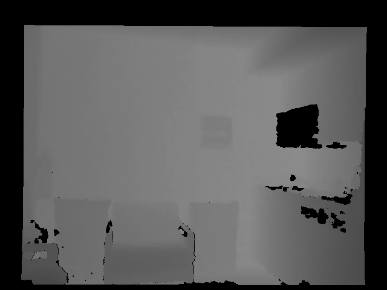
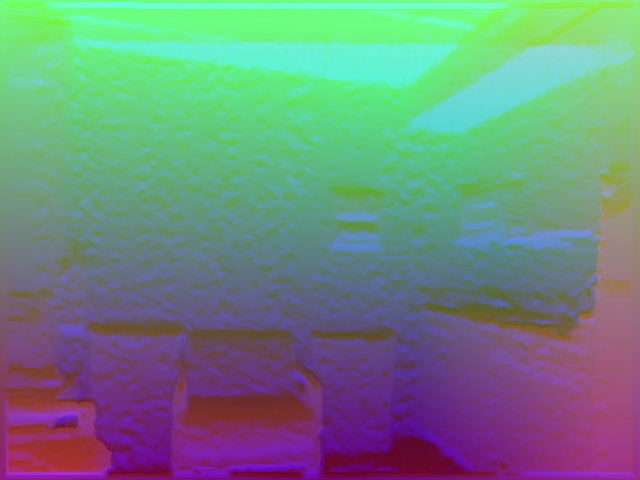
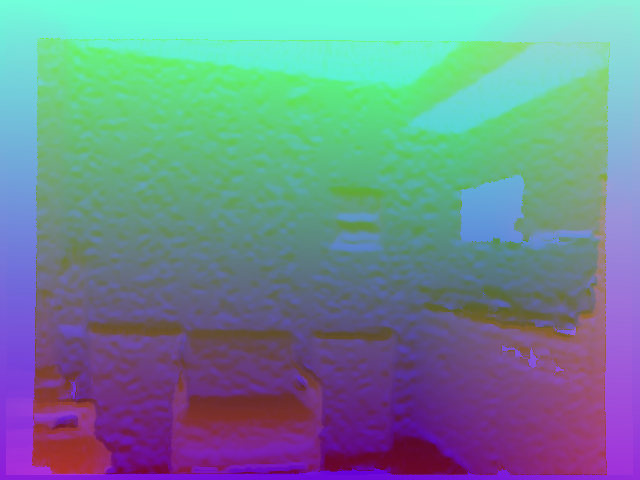

# Depth2HHA-python
### Introduction

This repo implements **HHA-encoding** algorithm in *python3*. **HHA image** is an encoding algorithm to make better use of depth images, which was proposed by  **<a href='https://github.com/s-gupta'>s-gupta</a>** in this paper:  <a href='https://arxiv.org/pdf/1407.5736.pdf'>Learning Rich Features from RGB-D Images for Object Detection and Segmentation</a>. This algorithm was implemented in MATLAB initially, and I organized a MATLAB version of the code: <a href='https://github.com/charlesCXK/Depth2HHA'>Depth2HHA-MATLAB</a>. In this repo, I use python3 to get exactly the same result as what MATLAB code does.

<br>

**All we need** is: 

1. A depth image
2. A raw-depth image (Option)
3. Camera matrix

<br>

**If you are confused about depth images or you don't have depth images, please refer to <a href='https://cs.nyu.edu/~silberman/datasets/nyu_depth_v2.html'>NYU Depth V2 dataset</a>.**

---

### Usage

I already provide an interface in **getHHA.py**. The function is named *getHHA(C, D, RD)*. To be detailed, it needs a camera matrix **C**, a depth image **D** and a raw depth image **RD**. **RD** is used to generate a mask to mark missing information, so it is ok to use *getHHA(C, D, D)* if you don't have a raw depth image or you just want to do so.

```python
D = cv2.imread(os.path.join(root, '0.png'), cv2.COLOR_BGR2GRAY)/10000
RD = cv2.imread(os.path.join(root, '0_raw.png'), cv2.COLOR_BGR2GRAY)/10000
camera_matrix = getCameraParam('color')
hha = getHHA(camera_matrix, D, RD)
```

---

### Tips

1. I recommend you to use **cv2.COLOR_BGR2GRAY** instead of **cv2.IMREAD_GRAYSCALE** to read in the gray image **D**. If you use **cv2.COLOR_BGR2GRAY**, you will get exactly the same gray values as MATLAB's **imread** function does. If you use **cv2.IMREAD_GRAYSCALE**, you won't.
2. The depth image array passed to function ***getHHA*** should in 'meter'. So in my demo code, I divide it with 10000 to modify the unit.
3. Camera matrix **C** is a 3*3 matrix.

---

### Results

Pictures below are:

D,  RD,  HHA from MATLAB,  HHA using D and RD,  HHA using D and D









---

### TODO

- Parallel processing

